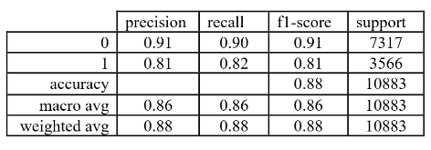
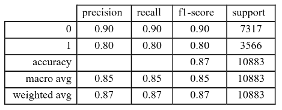
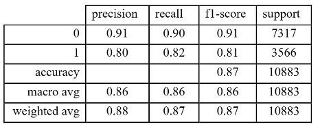

# Hotel Reservation Cancellation Prediction (Machine Learning)

Predict whether a hotel booking will be **Canceled** or **Not Canceled** using reservation and customer attributes.  
This project frames the problem as a **binary classification** task to help hotel operations anticipate cancellations and improve planning.

**Contributions:**  
- **Mansoo Cho** — analysis, modeling, and code implementation  
- **Gillian Kingsbury** — modeling and code implementation  
- **Danayit Shewamene** — report drafting  

---

## Business Problem
Hotels lose revenue and operational efficiency when a large share of reservations are canceled.  
If a hotel can estimate cancellation likelihood ahead of time, it can better manage:
- overbooking / underbooking decisions
- staffing and inventory planning
- pricing and policy adjustments (e.g., cancellation rules)

---

## Dataset
- **Source (Kaggle):** *Hotel Reservations Dataset (Classification)* — Ahsan Raza  
  https://www.kaggle.com/datasets/ahsan81/hotel-reservations-classification-dataset
- **Rows:** 36,275 reservations
- **Raw features:** 17 total  
  - 5 categorical/binary  
  - 12 numerical  
- **Target:** `booking_status` (Canceled vs Not Canceled)

> Note: This dataset is often confused with Kaggle’s “Hotel Booking Demand” dataset, which has a different schema/size.

### Feature Overview (raw)
Examples include:
- `lead_time` (days between booking and arrival)
- `avg_price_per_room`
- number of adults/children
- weekend/weekday nights
- meal plan, room type, market segment
- repeated guest flag, prior cancellations, special requests, etc.

---

## Approach

### Problem Definition
Binary classification:
- **0 = Not canceled**
- **1 = Canceled**

### Preprocessing
- One-hot encoding for categorical variables (e.g., room type, meal plan, market segment, arrival season)
- Standardization using `StandardScaler`
- Train/test split: **70% train / 30% test**
- Class imbalance handled using **SMOTE** (training set only)

### Feature Engineering / Reduction
After preprocessing we created **31 features** (one-hot encoded + scaled + SMOTE on train).

We compared three feature matrices:
1. **All features** (31 features)
2. **PCA features**  
   - kept components explaining **95%** variance (22 components)
3. **Backward elimination (Logit p-values)**  
   - retained **19 features** using significance threshold of 0.05

### Models Evaluated
Implemented using **scikit-learn** (and `statsmodels` for backward elimination):
- Logistic Regression
- SVM (RBF, Polynomial)
- Decision Tree
- Random Forest
- KNN
- Naïve Bayes
- Voting Classifier Ensemble

---

## Results Summary

### Accuracy by Model / Feature Set
| Model | All Features (31) | Backward Elimination (19) | PCA (22) |
|---|---:|---:|---:|
| Logistic Regression | 78.02% | 77.95% | 78.18% |
| SVM | 81.64% | 79.65% | 81.10% |
| KNN | 85.27% | 85.53% | 85.17% |
| Decision Tree | 86.72% | **88.81%** | 83.80% |
| Random Forest | **88.88%** | 88.81% | 86.94% |
| Naïve Bayes | 40.79% | 49.60% | 52.45% |
| Voting Classifier | 88.00% | 87.00% | 87.00% |

**Best single model:** Random Forest on all features (**88.88% accuracy**)  
**Best reduced-feature performance:** Decision Tree / Random Forest on backward-eliminated features (~**88.81%**)  
**Ensemble:** Voting Classifier achieved ~**0.88 accuracy** and strong overall performance.

---

## Voting Classifier Performance (Precision / Recall / F1)

Below are the `classification_report` results for the Voting Classifier trained on three feature sets.

### All Features (31)

### PCA Features (22)

### Backward Elimination (19)

**Takeaway:** The ensemble performs strongly overall (high weighted F1 / accuracy). Minority-class performance (Canceled) is naturally harder due to class imbalance and overlap in booking behavior.

---

## Key Insights (Feature Importance)
Across multiple models, the strongest predictors of cancellation were:
1) **Lead time** (days between booking and arrival)  
2) **Average price per room**

This supported our hypothesis that lead time and pricing are meaningful indicators of cancellation behavior.

---

## Repository Contents
- `hotel.ipynb` — end-to-end analysis (preprocessing → modeling → evaluation)
- `backward_elimination.py` — backward feature elimination helper (statsmodels)
- `img/` — exported plots / screenshot tables used in this README
- `data/` - hotel.csv dataset

